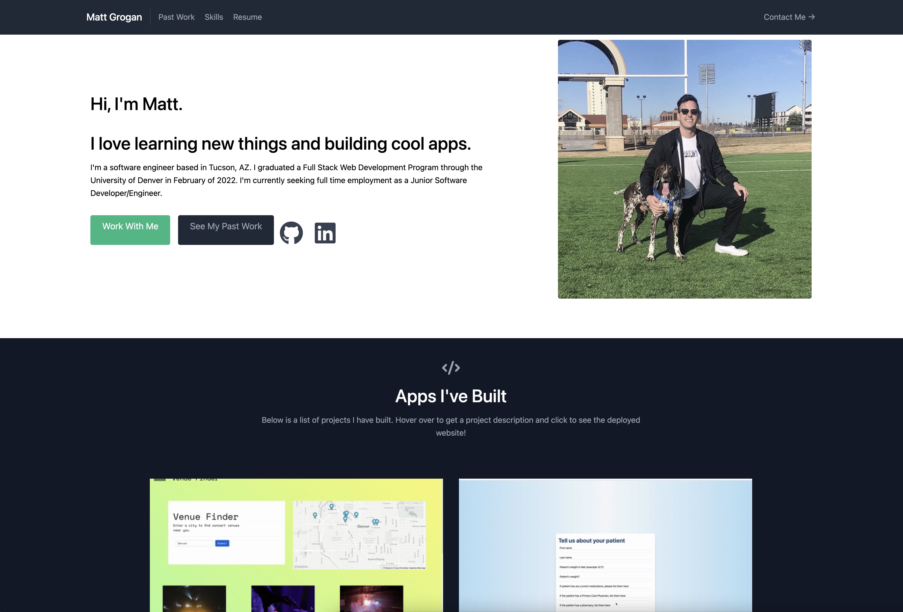
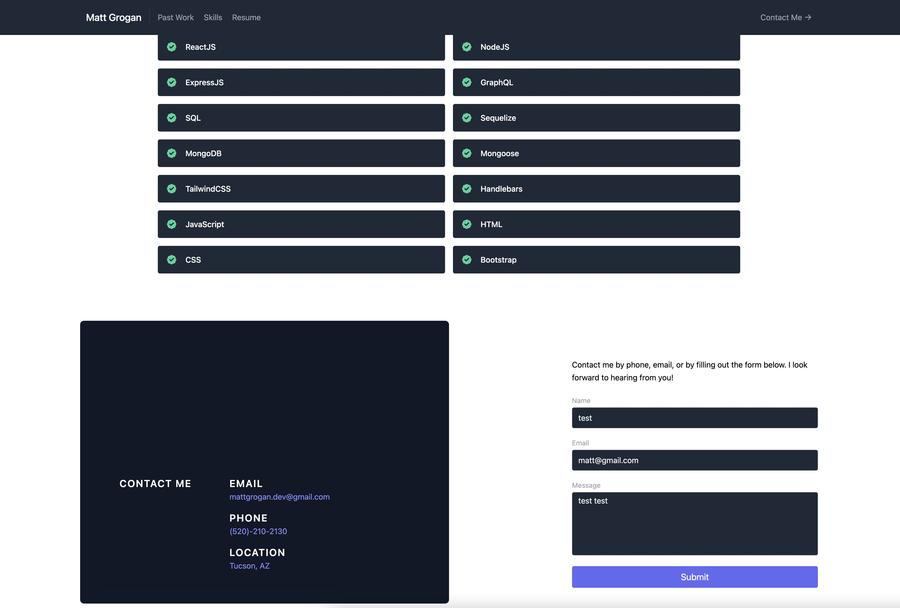

  My Portfolio 

## Description

This portfolio contains some information about me, links to my GitHub & LinkedIn, previous projects I've worked on with links, and a list of the different skills/technologies that I have learned.

## Table of Contents

- [Usage](#usage)
- [Repository-Link](#repository-link)
- [Media](#media)
- [Questions](#questions)
- [License](#license)

## Usage

Scroll through my portfolio to find out a little information about me and see the types of things I've worked on. If you are interested in connecting please reach out with the contact information provided at bottom of page or fill out the contact form. Thank you for taking the time to look at my portfolio!

## Repository-Link

[GitHub Repo Link](https://github.com/mattgrogandev/portfolio)
[Deployed Application Link](https://bit.ly/mattgrogandev)

## Media

## Questions

If you have any questions regarding this project please contact either on GitHub or by Email below.

GitHub: [mattgrogandev](https://github.com/mattgrogandev)

Email: mattgrogan.dev@gmail.com

## License

Licensed under the MIT license.

[Link to opensource.org license info](https://opensource.org/licenses/MIT)
